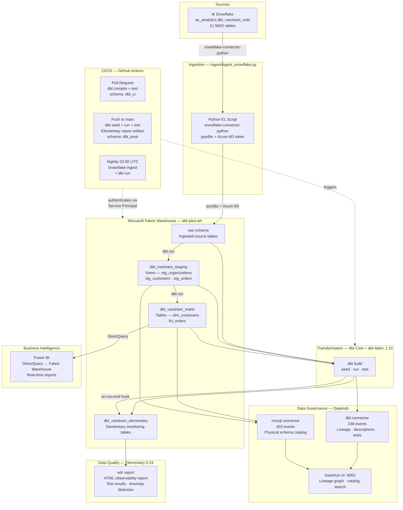
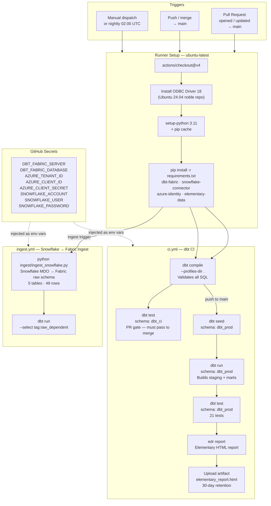
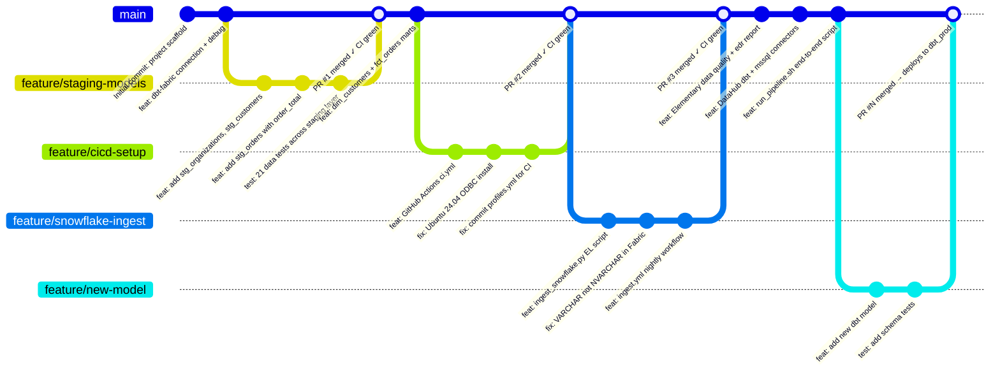

# Developer Setup Guide

dbt + Microsoft Fabric Warehouse local development and CI/CD setup.

---

## Architecture



---

## CI/CD Workflow

Two GitHub Actions workflows handle automation:



---

## Git Branching Strategy



> **Branch rules:**
> - `main` is protected — direct pushes blocked, PR required
> - PR triggers `dbt compile + test` against `dbt_ci` schema — must pass to merge
> - Merge to `main` triggers full deploy to `dbt_prod` + Elementary report artifact
> - `profiles.yml` is committed (env_var refs only, no secrets) — never add it back to `.gitignore`

---

## Prerequisites

| Tool | Version | Install |
|------|---------|---------|
| macOS | ARM64 (Apple Silicon) | — |
| Homebrew | latest | `https://brew.sh` |
| Python | 3.11 | `brew install python@3.11` |
| Azure CLI | 2.86+ | `brew install azure-cli` |
| Git | any | pre-installed on macOS |
| GitHub CLI | latest | `brew install gh` |
| ODBC Driver 17 for SQL Server | 17 | see below |

### Install ODBC Driver 17 (macOS)

```bash
brew tap microsoft/mssql-release https://github.com/Microsoft/homebrew-mssql-release
brew install msodbcsql17
```

Verify:
```bash
odbcinst -q -d  # should show [ODBC Driver 17 for SQL Server]
```

---

## 1. Azure Login

Log in to the Hexagon Azure tenant:

```bash
az login
```

Verify you are on the correct tenant:
```bash
az account show --output table
# Expected: Hexagon AP-Prod / Hexmet.onmicrosoft.com
```

---

## 2. SSH Key for GitHub

Generate an Ed25519 key (skip if you already have one at `~/.ssh/id_ed25519.pub`):

```bash
ssh-keygen -t ed25519 -C "your.name@hexagon.com" -f ~/.ssh/id_ed25519 -N ""
ssh-keyscan github.com >> ~/.ssh/known_hosts
```

Log into GitHub CLI and upload the key in one step:

```bash
gh auth login
# Choose: GitHub.com → SSH → Upload your SSH key → ~/.ssh/id_ed25519.pub → Login with web browser
```

Verify:
```bash
ssh -T git@github.com   # "Hi <username>! You've successfully authenticated..."
```

---

## 3. Clone the Repository

```bash
git clone git@github.com:vinays-hexagon/fabric-pilot-dbt.git
cd fabric-pilot-dbt
```

---

## 4. Python Virtual Environment

Create a dedicated venv for dbt-fabric (keep it separate from other dbt projects):

```bash
python3.11 -m venv ~/.dbt/fabric-venv
~/.dbt/fabric-venv/bin/pip install -r requirements.txt
```

Add a shell alias for convenience (add to `~/.zshrc`):

```bash
echo 'alias dbt-fabric="~/.dbt/fabric-venv/bin/dbt"' >> ~/.zshrc
source ~/.zshrc
```

Verify:
```bash
dbt-fabric --version
# Core: 1.11.x  |  Plugins: fabric: 1.10.x
```

---

## 5. Local dbt Profile

The `profiles.yml` committed to the repo is for **CI only** (uses env vars). For local development you need a separate profile in `~/.dbt/profiles.yml` that uses Azure CLI auth.

Add the following block to `~/.dbt/profiles.yml` (create the file if it doesn't exist):

```yaml
fabric_pilot:
  target: dev
  outputs:
    dev:
      type: fabric
      driver: 'ODBC Driver 17 for SQL Server'
      server: h2vrmg7wxdru7hz6fw374ve7ni-ptfanl5jjmiu5cy7hishzreaae.datawarehouse.fabric.microsoft.com
      port: 1433
      database: "dbt-pilot-wh"
      schema: dbt_<your_username>      # e.g. dbt_jsmith — keeps your dev schema isolated
      authentication: CLI
      threads: 4
```

> **Important:** `~/.dbt/profiles.yml` is in `.gitignore` — never commit it. It may contain credentials for other projects.

Test the connection:

```bash
cd fabric-pilot-dbt
dbt-fabric debug
# Expected: All checks passed!
```

---

## 6. Run dbt Locally

```bash
# Load seed data
dbt-fabric seed

# Build all models
dbt-fabric run

# Run all tests
dbt-fabric test

# Or do all three in one command
dbt-fabric build
```

Your models land in the following schemas in `dbt-pilot-wh`:

| Layer | Schema | Materialization |
|-------|--------|----------------|
| Seeds (raw) | `dbt_<username>` | Table |
| Staging | `dbt_<username>_staging` | View |
| Marts | `dbt_<username>_marts` | Table |

---

## 7. CI/CD — GitHub Actions

CI runs automatically on every PR and push to `main`. No action needed from developers beyond pushing code.

### How it works

| Event | Steps | Target schema |
|-------|-------|---------------|
| Pull Request | `dbt compile` + `dbt test` | `dbt_ci` |
| Push to `main` | `dbt seed` + `dbt run` + `dbt test` | `dbt_prod` |

### Required GitHub Secrets

These are already configured on the repo. If you are setting up a **new** repo fork, add these secrets under **Settings → Secrets → Actions**:

| Secret | Description |
|--------|-------------|
| `DBT_FABRIC_SERVER` | Fabric Warehouse SQL endpoint hostname |
| `DBT_FABRIC_DATABASE` | Warehouse name (e.g. `dbt-pilot-wh`) |
| `AZURE_TENANT_ID` | Azure AD tenant ID |
| `AZURE_CLIENT_ID` | Service Principal app ID |
| `AZURE_CLIENT_SECRET` | Service Principal client secret |

### Service Principal setup (new repo only)

1. Create the SP:
   ```bash
   az ad sp create-for-rbac --name "dbt-fabric-pilot-sp" --skip-assignment --output json
   ```
2. In the Fabric workspace UI: **Manage access → Add people or groups** → search for `dbt-fabric-pilot-sp` → set role to **Contributor**

---

## 8. Making Changes

### Feature branch workflow

```bash
git checkout -b feature/your-feature-name
# ... make changes ...
git add .
git commit -m "feat: describe your change"
git push origin feature/your-feature-name
```

Open a PR on GitHub. CI will run `dbt compile + test` automatically. Merge to `main` triggers the full deploy.

### T-SQL gotchas (Fabric Warehouse is T-SQL, not ANSI SQL)

| Instead of | Use |
|---|---|
| `true` / `false` | `CAST(1 AS BIT)` / `CAST(0 AS BIT)` |
| `date_trunc('month', col)` | `DATETRUNC(month, col)` |
| `current_date` | `CAST(GETDATE() AS DATE)` |
| `||` string concat | `+` or `CONCAT(a, b)` |

---

## 9. Project Structure

```
fabric-pilot-dbt/
├── models/
│   ├── staging/          # Views — clean and rename raw columns
│   │   ├── stg_organizations.sql
│   │   ├── stg_customers.sql
│   │   ├── stg_orders.sql
│   │   └── schema.yml
│   └── marts/            # Tables — business-ready dimensions and facts
│       ├── dim_customers.sql
│       ├── fct_orders.sql
│       └── schema.yml
├── seeds/                # Static CSV reference data (loaded via dbt seed)
├── tests/                # Custom singular tests
├── macros/               # Reusable Jinja macros
├── .github/workflows/
│   └── ci.yml            # GitHub Actions CI/CD pipeline
├── profiles.yml          # CI profile (env_var refs only — safe to commit)
├── dbt_project.yml       # dbt project config
├── requirements.txt      # Pinned Python dependencies
└── DEVELOPER_SETUP.md    # This file
```

---

## Troubleshooting

**`dbt debug` fails with `Login timeout expired`**
- Ensure you are logged in: `az login`
- Ensure your account has access to the Fabric workspace

**`dbt debug` fails with `Could not find profile named 'fabric_pilot'`**
- Check `~/.dbt/profiles.yml` exists and has the `fabric_pilot` key
- You may be running `dbt` from the wrong venv — use `dbt-fabric` alias

**`Invalid column name 'true'` in a model**
- Replace `true`/`false` literals with `CAST(1 AS BIT)`/`CAST(0 AS BIT)`

**CI fails with `Could not find profile named 'fabric_pilot'`**
- `profiles.yml` must be committed to the repo — do not add it back to `.gitignore`

**CI fails with `gpg: cannot open '/dev/tty'`**
- Ensure the ODBC install step uses `gpg --batch --dearmor` and pipes via `sudo tee`
- Ensure the apt repo URL is for Ubuntu 24.04 (`noble`), not 22.04 (`jammy`)

---

## 10. Running the Full Pipeline Locally

`run_pipeline.sh` runs all three stages end-to-end:

```bash
# Set required env vars first
export SNOWFLAKE_ACCOUNT=ZFSYMIS-RX17347
export SNOWFLAKE_USER=elt_user
export SNOWFLAKE_PASSWORD=<password>
export DBT_FABRIC_SERVER=<warehouse-sql-endpoint>
export DBT_FABRIC_DATABASE=dbt-pilot-wh

./run_pipeline.sh
```

Flags to skip individual stages:
```bash
./run_pipeline.sh --skip-ingest       # skip Snowflake ingestion
./run_pipeline.sh --skip-dbt          # skip dbt build
./run_pipeline.sh --skip-elementary   # skip Elementary report
```

---

## 11. Data Quality — Elementary

Elementary captures dbt test results in `dbt-pilot-wh.dbt_vsesham_elementary`.

Generate a local report any time:
```bash
edr report --profiles-dir ~/.dbt --profile-target dev
# Opens edr_target/elementary_report.html in your browser
```

---

## 12. Power BI — Connecting to Fabric Warehouse

> **Note:** DirectLake mode requires a Fabric Lakehouse. For Fabric Warehouse use DirectQuery (real-time, zero-copy via SQL endpoint).

Fabric automatically creates a **default semantic model** for every Warehouse — no Power BI Desktop needed.

1. Open your Fabric workspace → click `dbt-pilot-wh`
2. In the toolbar click **New report**
3. Power BI opens in DirectQuery mode connected to the Warehouse
4. In the **Data** pane, expand `dbt_vsesham_marts` → `dim_customers` and `fct_orders`
5. Build your report and click **Save**

**Gotcha:** `NVARCHAR` is not supported in Fabric Warehouse (trial). All string columns are `VARCHAR(4000)`. This does not affect Power BI — it reads column types correctly.
